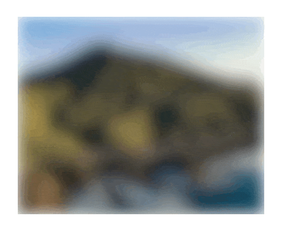

# react-xray
> Accessible image component that reveals images on user interaction

## Installation
```bash
npm install @nikxda/react-xray
```

## Try it online

The storybook is available here: https://react-xray.vercel.app/

## Preview



# Features

- :gear:&nbsp;&nbsp;Fully customizable
- :sparkles:&nbsp;&nbsp;Custom `feColorMatrix` effects
- :computer:&nbsp;&nbsp;Responsive out of the box
- :iphone:&nbsp;&nbsp;Touch support
- :eyeglasses:&nbsp;&nbsp;Basic accessibility built-in
- :tada:&nbsp;&nbsp;Custom transitions
- :mag:&nbsp;&nbsp;Zoom mode

## Usage

```jsx
import XRay from '@nikxda/react-xray';

const ExampleComponent = () => (
 <div>
  <h1>An Example Image</h1>
  <XRay href="http://picsum.photos/1920/1080" alt="Lorem Picsum">
 </div>
)
```

## Component Props

The following properties are available:

|Prop Name|Type|Default Value|Description|Required|
|---|---|---|---|---|
|href|`string`|-|The image URL.|Yes|
|alt|`string`|-|A description of the image.|Yes|
|blur|`number`|`15`|The amount of blur.|No|
|radiusScale|`number`|`1`|The factor by which to scale the default responsive radius.|No|
|fixedRadius|`number`|`null`|If no responsive radius is desired, a fixed radius can be applied.|No|
|onClick|`function`|`()=>{}`|An onClick handler.|No|
|effects|`string[]`|`[]`|Effects to be applied globally, see Effects.|No|
|imageLayerEffects|`string[]`|`[]`|Effects to be applied to the image layer, see Effects.|No|
|blurLayerEffects|`string[]`|`[]`|Effects to be applied to the blur layer, see Effects.|No|
|circleInTransition|`string`|`"elastic.out(1, 0.3)"`|The GSAP transition which will be used to transition the circle in.|No|
|circleInDuration|`number`|`0.5`|The duration of the `circleInTransition`|No|
|circleOutTransition|`string`|`"expo.out"`|The GSAP transition which will be used to transition the circle out.|No|
|circleOutDuration|`number`|`0.2`|The duration of the `circleOutTransition`|No|
|zoom|`number`|`1`|The amount of zoom.|No|

## Accessibility

React XRay provides basic accessibility out of the box. It features touch support for mobile devices and incorporates responsive behaviour by default.

## License

MIT